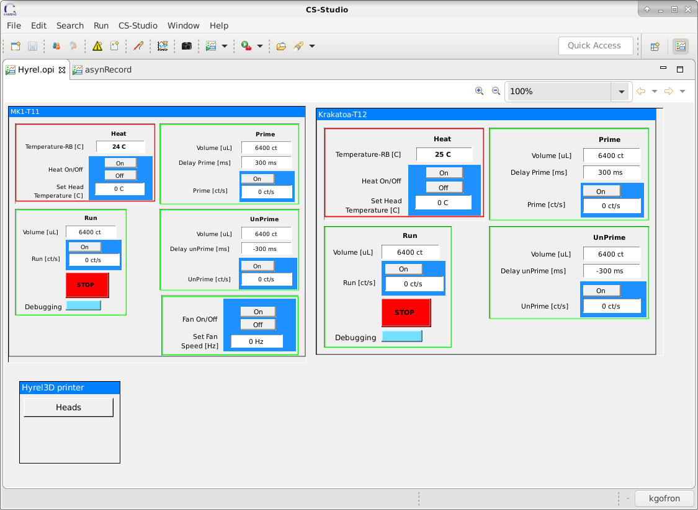
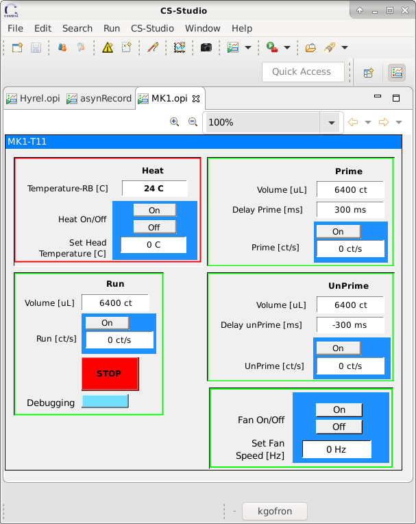
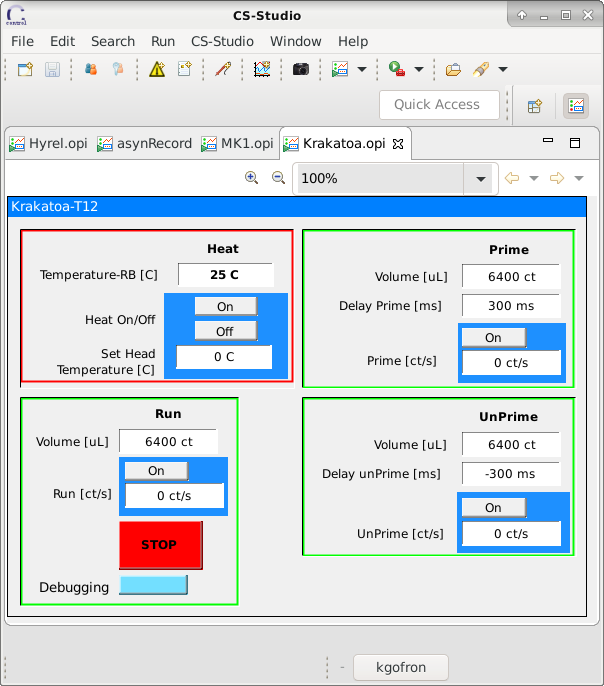
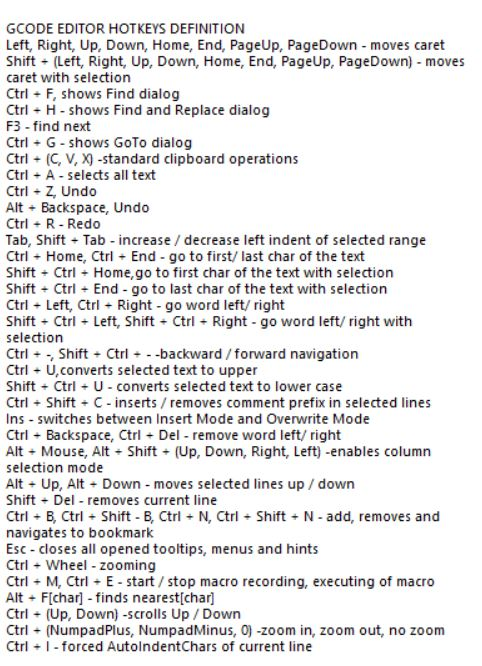
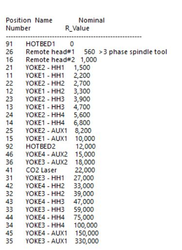

======================================
hyrel3d
======================================

:author: Kazimierz Gofron, Brookhaven National Laboratory

.. contents:: Contents

.. _GenICam:      https://www.emva.org/standards-technology/genicam
.. _ADGenICam:    https://github.com/areaDetector/ADGenICam

Overview
--------

This is an :doc:`../index`  driver for HYREL 3D  printer with MK1 and Krakatoa heads.

CSS screens
------------
The following is the CSS OPI screen Hyrel.opi when controlling a two Krakatoa and MK1 print heads HYREL 3D printer.
This screen is generic and can be used for any .

The following is the CSS screen of MK1 head contraining fan control.

	    
The following is the CSS screen of Krakatoa head.

The following are the additional two images showing few g-codes and resistor settings for the CAN-bus.

Manuals
-------
	    
.. image::  1.Hyrel_Quickstart.pdf	   
	    2.Hyrel_Intro_EMO.pdf
	    3.Hyrel_MK1_Single.pdf
	    4.Hyrel_MK1_Multiple.pdf

	    
Known issues
------------    
- The Hyrel 3D printer has many features and currently has no calibration from motor steps to uL of volume. 

